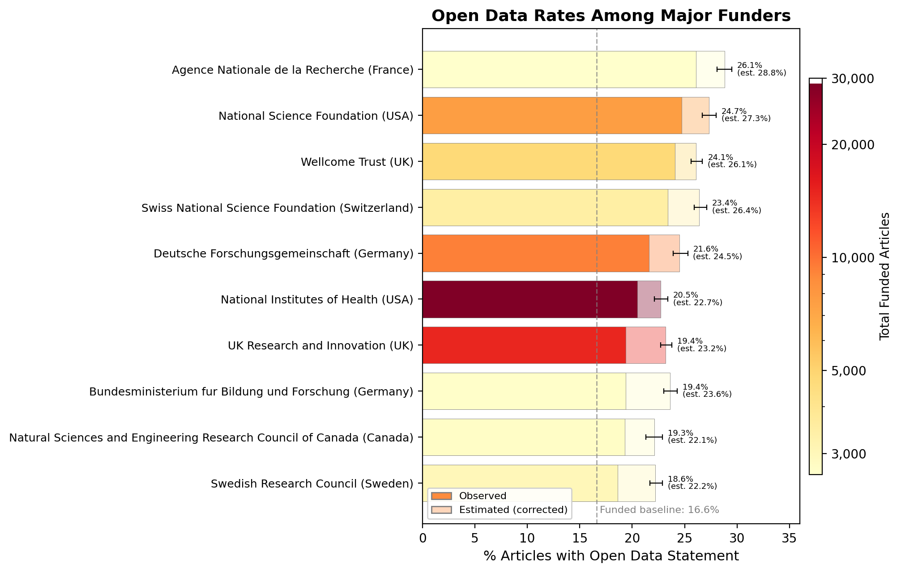

# Who funds Open Science?

Extended abstract for the [4th International Conference on the Science of Science & Innovation (ICSSI)](https://www.icssi.org/), June 29 -- July 1, 2026, University of Colorado Boulder.

## Abstract

We analyze approximately 784,000 open access biomedical research articles (January 2024 -- June 2025) to measure open data sharing rates across 816 funders and 1,389 journals. Using PDF-based text extraction ([MinerU](https://github.com/opendatalab/MinerU)) and algorithmic detection ([oddpub v7.2.3](https://github.com/quest-bih/oddpub)), we find an overall open data rate of 8.7%, rising to 16.6% among funded articles, with substantial variation across major funders. Results are available via an interactive dashboard at [opensciencemetrics.org](https://www.opensciencemetrics.org).



## Authors

- Josh Lawrimore -- Clinical Monitoring Research Program Directorate, Frederick National Laboratory for Cancer Research
- Christoph Li -- Data Science & Sharing Team, National Institute of Mental Health
- Dustin Moraczewski -- Data Science & Sharing Team, National Institute of Mental Health
- Adam Thomas -- Data Science & Sharing Team, National Institute of Mental Health

## Repository Contents

| File | Description |
|------|-------------|
| `abstract_icssi_2026.tex` | LaTeX source for the 2-page extended abstract |
| `abstract_icssi_2026.pdf` | Compiled PDF |
| `bibliography.bib` | BibTeX references (unused; references are inline in the .tex) |
| `generate_figure.py` | Python script to generate the top-10 funder bar chart |
| `funders_top10.png` | Generated figure used in the abstract |
| `template_latex_icssi_2026.tex` | ICSSI-provided LaTeX template |
| `template_word_icssi_2026.docx` | ICSSI-provided Word template |

## Building

Compile the abstract with [tectonic](https://tectonic-typesetting.github.io/) or pdflatex:

```bash
tectonic abstract_icssi_2026.tex
```

Regenerate the figure (requires pandas and matplotlib):

```bash
uv run --with pandas --with matplotlib python generate_figure.py
```

The figure script reads funder summary data from `../osm-preprint-2026/results/funders_summary_2024_2025.csv`.

## Related Repositories

- [osm-pipeline](https://github.com/nimh-dsst/osm-pipeline) -- Data processing pipeline
- [osm-dashboard-new](https://github.com/nimh-dsst/osm-dashboard-new) -- Interactive dashboard at opensciencemetrics.org
- [osm-preprint-2026](https://github.com/nimh-dsst/osm-preprint-2026) -- Full preprint manuscript
- [open-science-metrics](https://github.com/nimh-dsst/open-science-metrics) -- Meta repository
